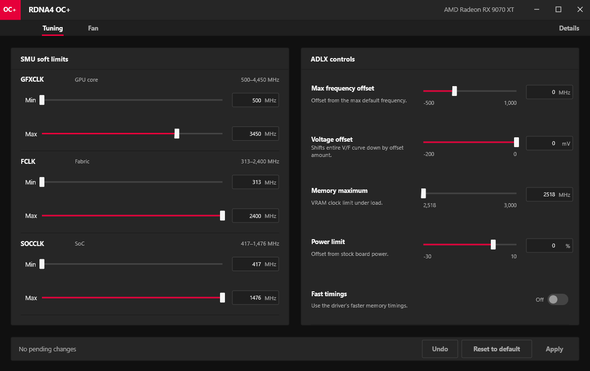

# RDNA4 OC+

Simple OC utility for RDNA4 GPUs. About 500 KB and uses about 15.5 MB of RAM.

## Features

- Adrenalin controls: max clock offset, voltage offset, power limit, VRAM clock limit, and memory timings.
- Additional SMU controls: GFXCLK soft min/max, FCLK, and SOCCLK.
- 5-point fan control.

Download the ready-to-run EXE from **Releases**.
